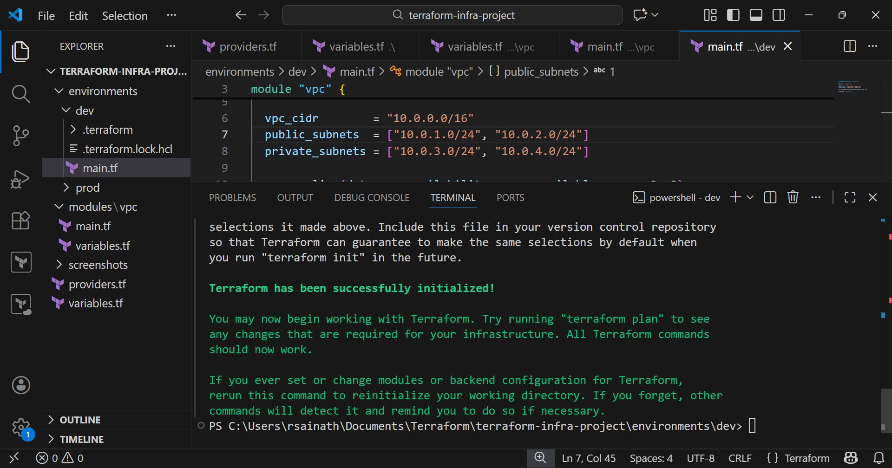
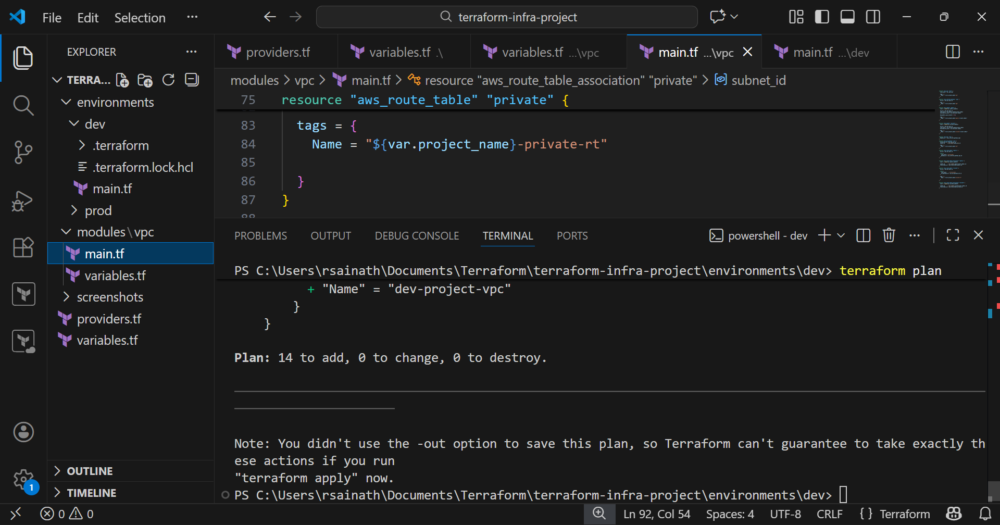
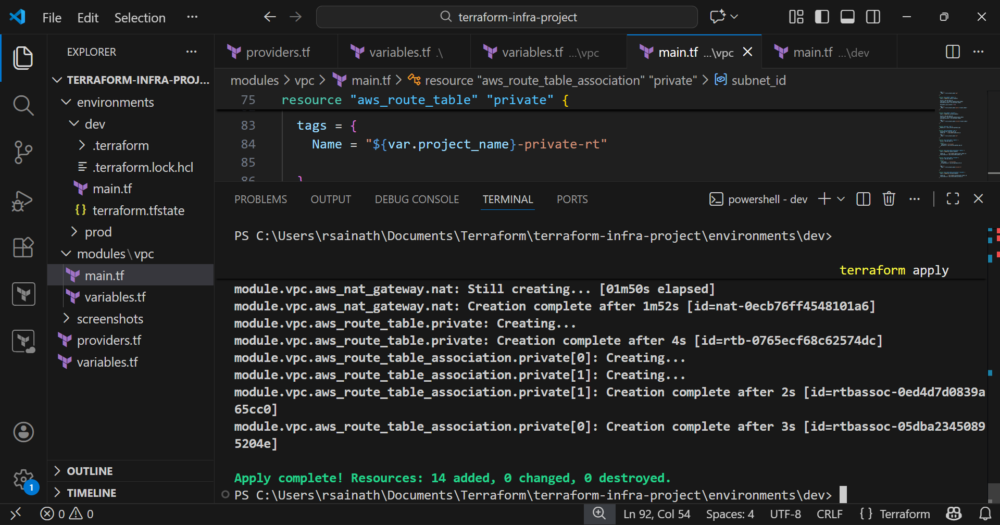
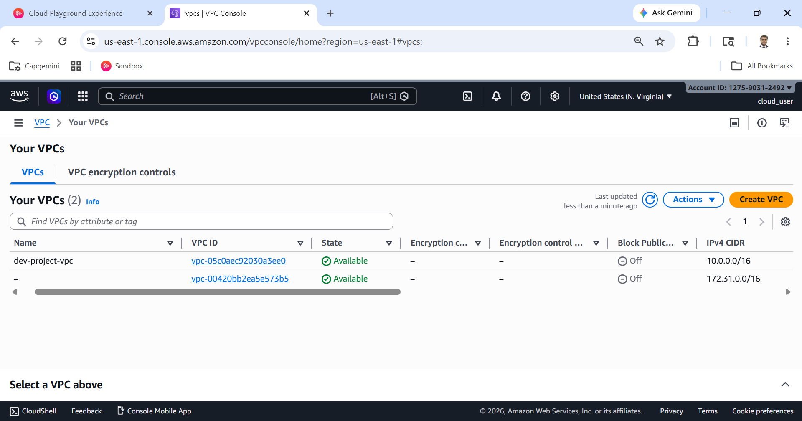
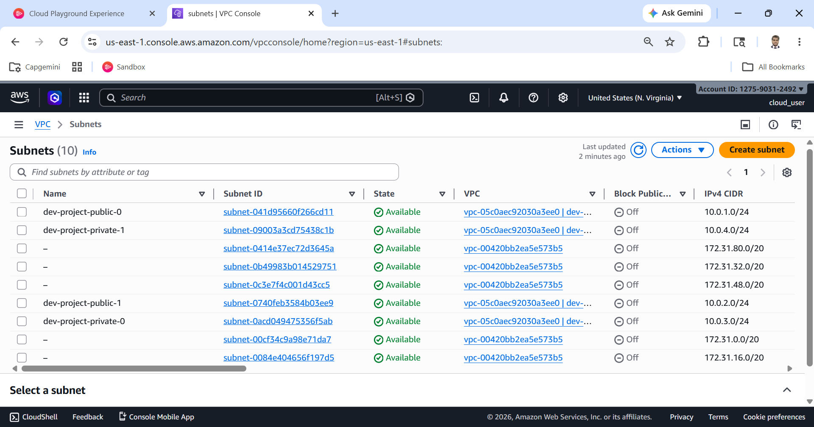
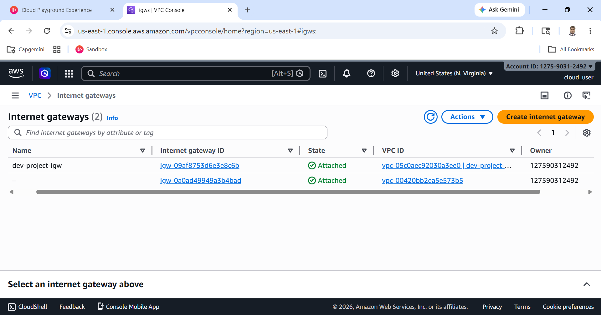
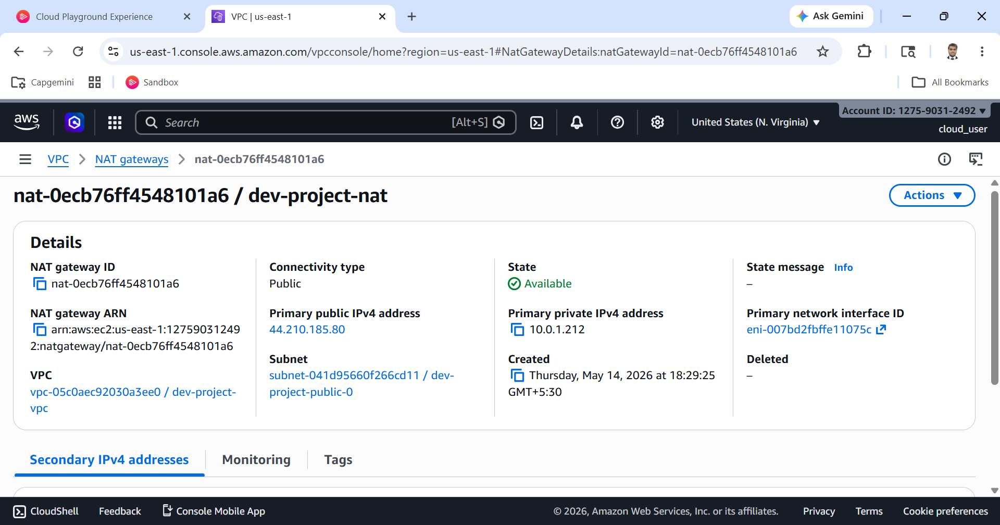
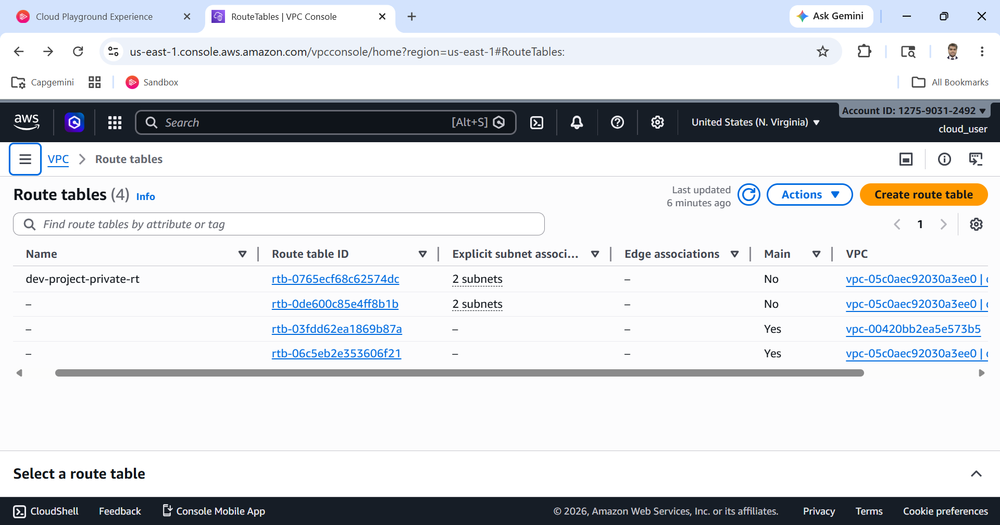

# AWS VPC Infrastructure using Terraform

## 🚀 Project Overview

This project demonstrates how to provision a real-world AWS networking infrastructure using Terraform following Infrastructure as Code (IaC) principles.

The main objective is to design a secure, scalable, and modular VPC architecture with public and private subnets across multiple Availability Zones.

---

## 🏗️ Architecture Explanation

The infrastructure is built inside a custom VPC and follows a common real-world architecture pattern:

- A single VPC with CIDR block 10.0.0.0/16
- Two public subnets placed in different Availability Zones
- Two private subnets placed in different Availability Zones
- Internet Gateway attached to the VPC
- NAT Gateway deployed in public subnet
- Route tables for traffic management

### 🔹 Public Subnets
- Have direct access to the internet via Internet Gateway
- Used for internet-facing components

### 🔹 Private Subnets
- No direct internet access
- Use NAT Gateway for outbound internet connectivity
- Ideal for backend and secure workloads

---

## ⚙️ Workflow

Step 1: Configure AWS CLI with credentials  
Step 2: Write Terraform configuration files  
Step 3: Initialize Terraform using `terraform init`  
Step 4: Validate infrastructure using `terraform plan`  
Step 5: Deploy resources using `terraform apply`  
Step 6: Verify resources in AWS Console  

---

## 📁 Project Structure

terraform-aws-core-infra/
├── modules/
│   └── vpc/
├── environments/
│   ├── dev/
│   └── prod/
├── screenshots/
├── providers.tf
├── variables.tf
└── README.md

---

## 🧪 How to Run

```bash
terraform init
terraform plan
terraform apply
```

---

## 📸 Screenshots

### Screenshot 1: AWS CLI Configuration


### Screenshot 2: Terraform Init


### Screenshot 3: Terraform Plan


### Screenshot 4: Terraform Apply


### Screenshot 5: VPC Created


### Screenshot 6: Subnets (Public & Private)


### Screenshot 7: Internet Gateway Attached


### Screenshot 8: NAT Gateway


### Screenshot 9: Route Tables


---

## ⚠️ Challenges Faced

- Incorrect NAT Gateway reference fixed using proper Terraform syntax
- Availability Zone mismatch resolved using correct region configuration

---

## 📘 Learning Outcomes

- Gained hands-on experience with Terraform modules
- Understood AWS VPC networking concepts
- Learned how to troubleshoot infrastructure issues

---

## 💡 Future Enhancements

- Add EC2 instances in private subnets
- Implement remote backend using S3 and DynamoDB
- Add CI/CD pipeline using GitHub Actions
- Enhance security using Security Groups

---

## ✅ Conclusion

This project provides a solid foundation in AWS networking and Terraform, demonstrating how infrastructure can be automated and managed efficiently using code.
